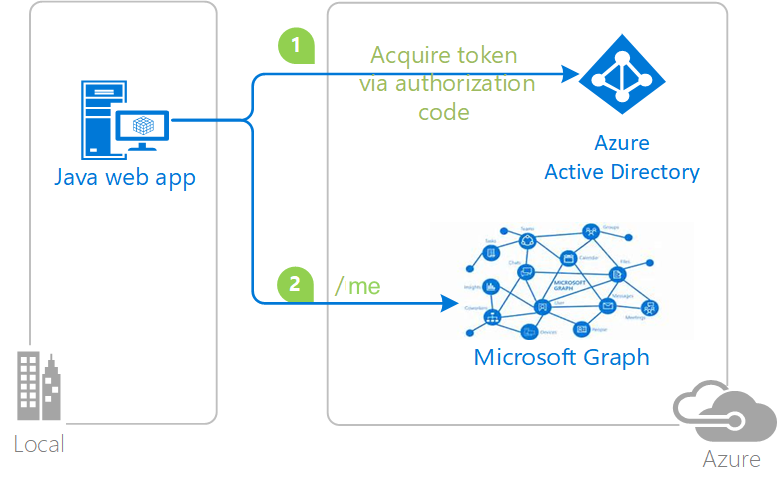
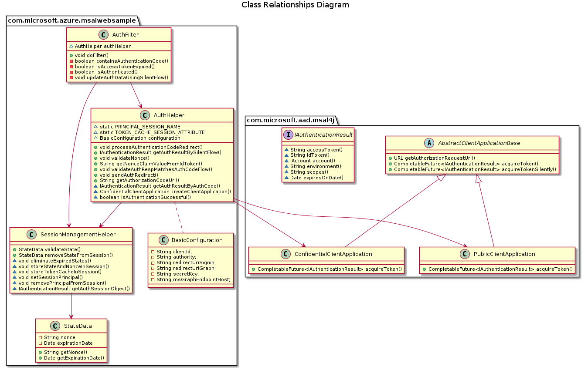

# msal-java-web

+[](https://github.com/PandaRory/msal-java-web/actions)

A Java web app that uses OpenId Connect to sign in/ sign out an user and to get access to the Microsoft Graph using MSAL4J.

This project originated from [msal-java-webapp-sample](https://github.com/Azure-Samples/ms-identity-java-webapp/tree/master/msal-java-webapp-sample). 

## Architecture

### Topology
The Java web application uses the Microsoft Authentication Library for Java (MSAL4J) to obtain an:

- Id Token from Azure AD to sign in an user.
- Access Token (Bearer token) is used to call the Microsoft Graph to get basic information of the signed-in user.



### Class Diagram



## Prerequisites

### AAD configuration
After registering the application on Azure Active Directory. Fill information in `application.properties`.
```
aad.clientId=Enter_the_Application_Id_here
aad.authority=https://login.microsoftonline.com/Enter_the_Tenant_Info_Here/
aad.secretKey=Enter_the_Client_Secret_Here
aad.redirectUriSignin=https://localhost:8443/msal4jsample/secure/aad
aad.redirectUriGraph=https://localhost:8443/msal4jsample/graph/me
aad.msGraphEndpointHost=https://graph.microsoft.com/
```

### SSL configuration

In order to use `https` with localhost. Use `keytool` utility (included in JRE) if you want to generate self-signed certificate. Put the certificate file (eg. keystore.p12) under `src/main/resources` directory.

```
server.port=8443
server.servlet.session.cookie.secure=true
server.ssl.key-store=classpath:Enter_Key_Store_Here
server.ssl.key-store-password=Enter_Key_Store_Password_Here
server.ssl.key-store-type=Enter_Key_Store_Type_Here
server.ssl.key-alias=Enter_Key_Alias_Here
server.ssl.key-password=Enter_Key_Password_Here
```

## Usage

The detail steps to run this sample are described in msal-java-webapp-sample [README](https://github.com/Azure-Samples/ms-identity-java-webapp/blob/master/msal-java-webapp-sample/README.md).